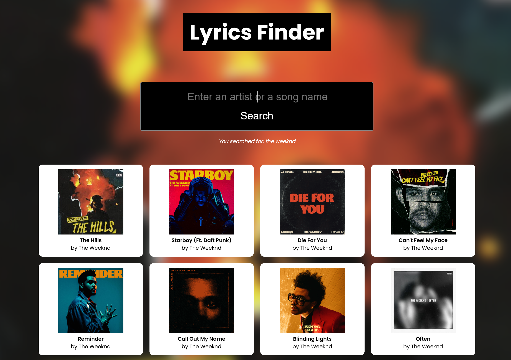

# Lyrics Finder



Lyrics Finder is a modern, user-friendly application that allows users to search for lyrics from their favorite songs or artists. By querying the Genius API through a secure backend, the app ensures smooth performance and API key protection — all with a sleek, interactive frontend.

## Table of Contents

1. [About the Project](#about-the-project)  
2. [Live Demo](#live-demo)  
3. [Technologies Used](#technologies-used)  
4. [Features](#features)  
5. [Installation and Usage](#installation-and-usage)  
6. [Project Structure](#project-structure)  
7. [Customization](#customization)  
8. [Performance Optimization](#performance-optimization)  
9. [Potential Enhancements](#potential-enhancements)  
10. [Contact](#contact)  
11. [License](#license)

## About the Project

Lyrics Finder enables users to search for song lyrics by typing in either a song name or artist. The app sends the user's query to a custom backend (hosted on Render), which then securely communicates with the Genius API and returns relevant results. This design avoids exposing the Genius API key to the public and showcases proper full-stack separation.

## Live Demo

Check out the [live demo here](https://jasr1.github.io/lyrics-finder/) to experience the app in action.  
The frontend is hosted on **GitHub Pages**, and it communicates with the backend hosted on **Render** to securely fetch results from the Genius API. 

Since I am using the free tier of Render, the backend spins down after periods of inactivity. As such, your first request may take upwards of 30 seconds. After that, each subsequent request will be sent immediately.


## Technologies Used

- **HTML5**
- **CSS3**
- **JavaScript (Vanilla JS)**
- **Express.js (Node.js)**
- **Genius API**
- **Render (for backend hosting)**

## Features

- **Live Lyrics Search**: Users can search by song or artist name and receive clickable results linking directly to Genius pages.

- **Secure Backend Proxy**: Frontend routes all queries to a backend endpoint to protect the Genius API key.

- **Dynamic UI**: Background changes based on the top result’s cover art using blur filters (when supported).

- **Responsive Design**: Works well across modern screen sizes and devices.

- **CORS Enabled**: Ensures smooth communication between frontend and Render-hosted backend.

## Installation and Usage

To run the project locally, follow the steps below:

### Frontend

1. Clone the repository:

```bash
git clone https://github.com/jasr1/lyrics-finder.git
cd lyrics-finder
```

2. Open `index.html` in your browser (or run a local server for development).

### Backend
1. Clone the backend repository (stored separately):
```bash
git clone https://github.com/jasr1/lyrics-finder-backend.git
cd lyrics-finder-backend
```

2. Install dependencies:
```
npm install
```

3. Create a `.env` file and add your Genius API key:
```
GENIUS_API_KEY="your-genius-api-key"
```
4. Run the server:
```
node index.js
```

5. (Optional) Deploy the backend to a platform like Render for public access.

## Project Structure

### Frontend
```
lyrics-finder/
├── scripts/
│   └── script.js         # Handles search input, fetch requests, and UI rendering
├── styles/
│   └── main.css          # Frontend styles
├── index.html            # Main HTML entry point
└── assets/
    └── lyrics-finder-preview.png  # Demo image
```

### Backend
```
lyrics-finder-backend/
├── routes/
│   └── lyrics.js         # Express route that queries the Genius API
├── .env                  # Stores Genius API key (not pushed to repo)
├── index.js              # Main Express server entry point
└── package.json
```

## Customization
- **Backend Endpoint**: Replace the Render URL in script.js if you're self-hosting or using a different deployment service.

- **Styling**: Modify main.css to personalize the visual theme or layout.

- **API Enhancement**: Extend the backend route to support lyrics scraping or fetching full lyrics pages.

## Performance Optimization
- **Backend API Routing**: Keeps API keys secure and limits exposure from the frontend.

- **CDN Font Loading**: Uses preconnect and preload headers for Google Fonts.

- **Efficient Rendering**: Appends only necessary DOM elements for each result, improving browser performance.

## Potential Enhancements
- Add lyrics preview in the card UI directly.

- Handle no-results and error states with user-friendly messages.

- Add pagination or infinite scroll for more results.

## Contact

Feel free to connect with me:

- **GitHub**: [jasr1](https://github.com/jasr1)

- **LinkedIn**: [LinkedIn](https://www.linkedin.com/in/jasrandhawa-softwaredeveloper/)


Thank you for exploring this project!

## License

This project is licensed under the MIT License. See the [LICENSE](LICENSE) file for details.

